# Documentación del examen practico

---

### **Test 1: Interacción Rotativa (Navegación)**
* **Objetivo:** Comprobar que los enlaces de acceso entre las diferentes vistas de autenticación funcionan correctamente.
* **Descripción:** Navegación fluida entre las pantallas de Inicio de Sesión, Registro de Usuario y Recuperación de Contraseña sin rupturas de flujo.
* **Evidencias:** 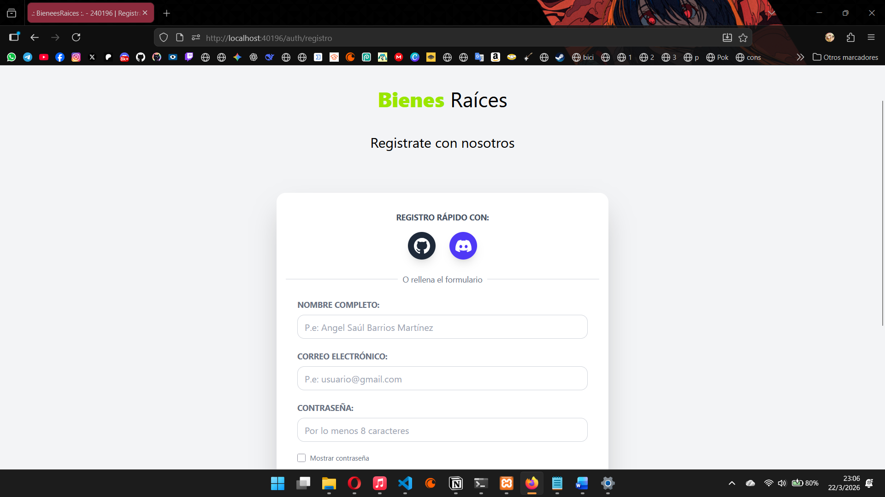
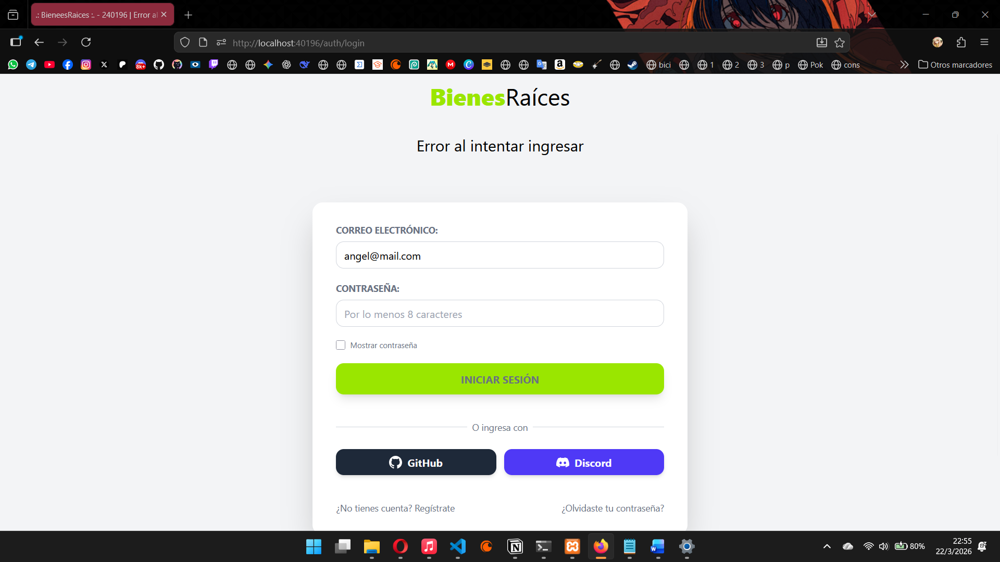
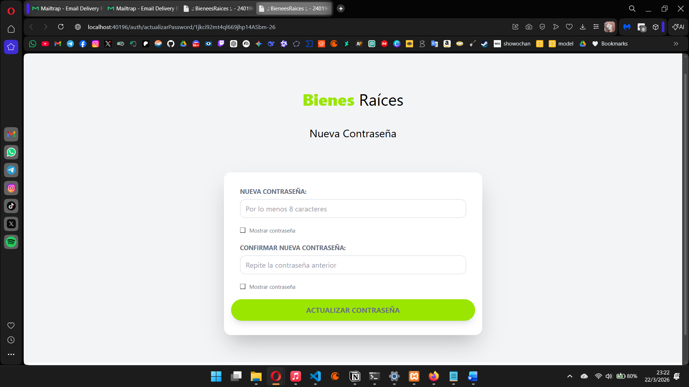

---

### **Test 2: Registro Exitoso de un Nuevo Usuario**
* **Objetivo:** Validar la creación correcta de una cuenta en la base de datos.
* **Flujo:** El usuario ingresa datos válidos y el sistema procesa el alta de forma exitosa, disparando el mensaje de confirmación.
* **Evidencias:** 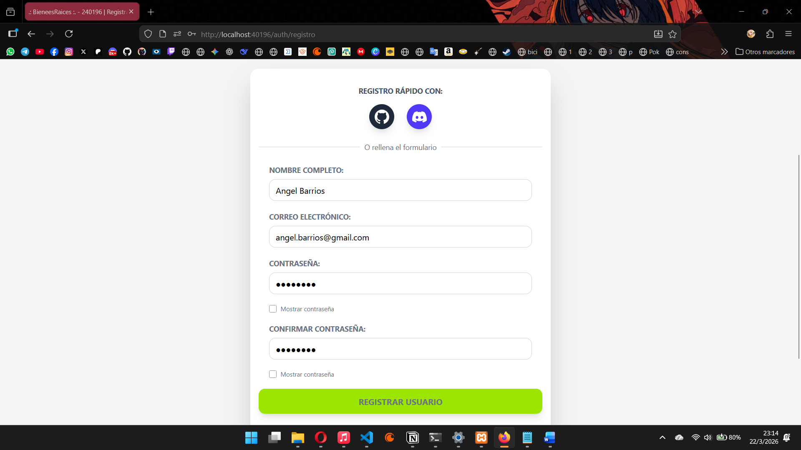
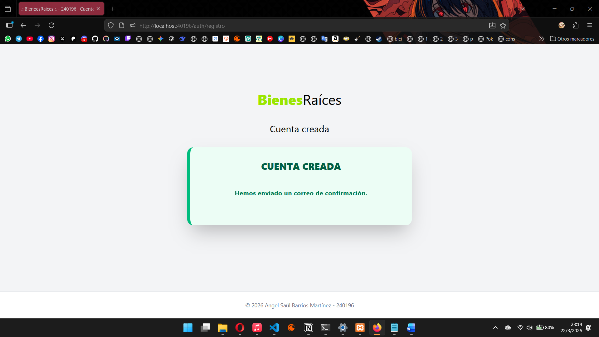

---

### **Test 3: Registro Fallido (Errores de Formulario)**
* **Objetivo:** Verificar que el sistema bloquee registros con datos incompletos o formatos inválidos.
* **Descripción:** Intento de registro con campos vacíos o contraseñas que no cumplen con el mínimo de 8 caracteres.
* **Evidencias:** 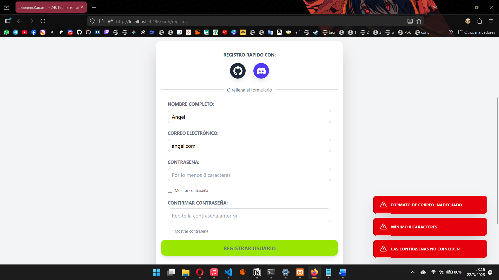

---

### **Test 4: Registro Fallido por Correo Duplicado**
* **Objetivo:** Garantizar la unicidad de las cuentas y evitar duplicidad de registros.
* **Descripción:** Intento de registro utilizando un correo electrónico que ya se encuentra activo en la base de datos.
* **Evidencias:** 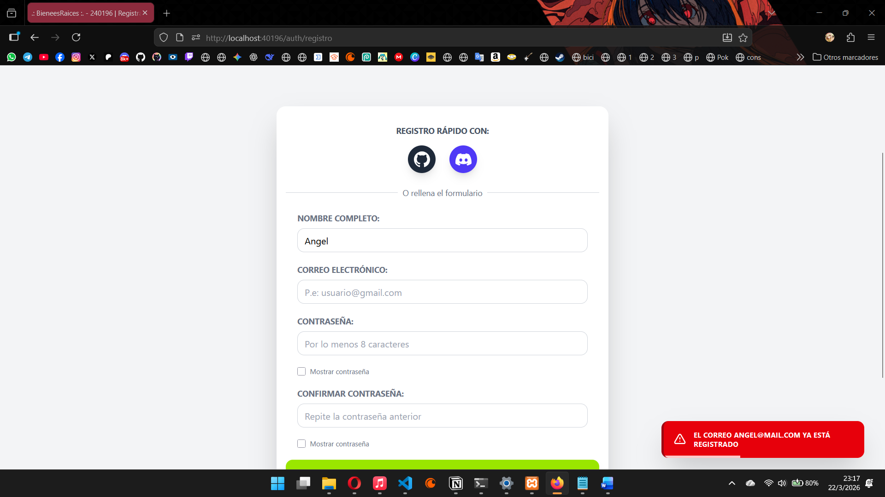

---

### **Test 5: Validación de Usuario por Email**
* **Objetivo:** Confirmar que el proceso de activación de cuenta mediante Token (vía correo) funciona correctamente.
* **Descripción:** Uso del enlace de verificación para cambiar el estado del usuario de "No confirmado" a "Confirmado".
* **Evidencias:** 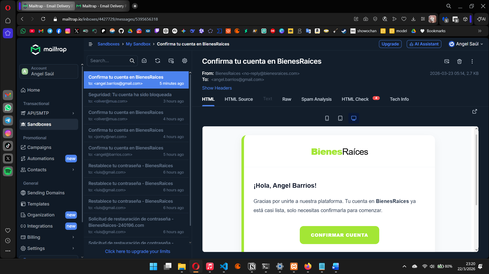
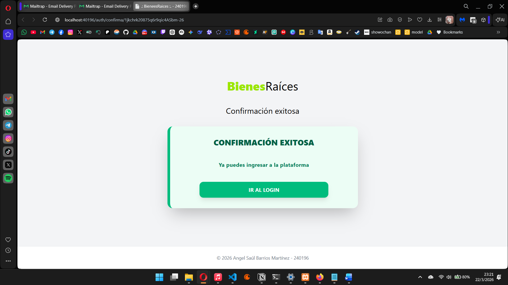

---

### **Test 6: Actualización Exitosa de Contraseña**
* **Objetivo:** Validar el cambio de credenciales para un usuario que ha validado su identidad.
* **Flujo:** Solicitud de recuperación, recepción de email, ingreso de nueva clave y guardado exitoso en el sistema.
* **Evidencias:** 
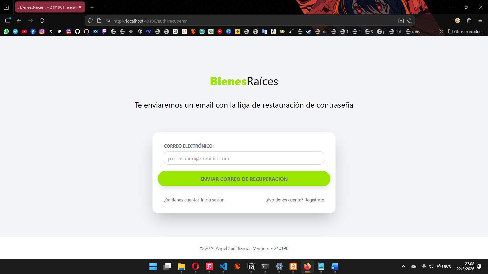
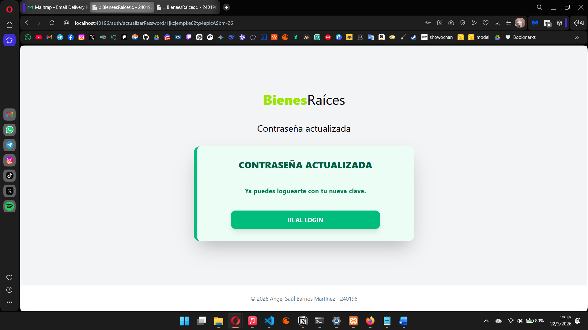

---

### **Test 7: Actualización Fallida (Usuario no validado)**
* **Objetivo:** Comprobar que no se generen procesos de recuperación para correos inexistentes.
* **Descripción:** Intento de solicitar el cambio de password con un email que no existe en el sistema.
* **Evidencias:** 

---

### **Test 8: Actualización Fallida (Errores de Formulario y Token Inválido)**
* **Objetivo:** Verificar la seguridad del sistema ante tokens expirados o alterados.
* **Descripción:** Intento de actualizar la contraseña con un token que ya fue utilizado, que ha expirado o que no corresponde al usuario.
* **Evidencias:** 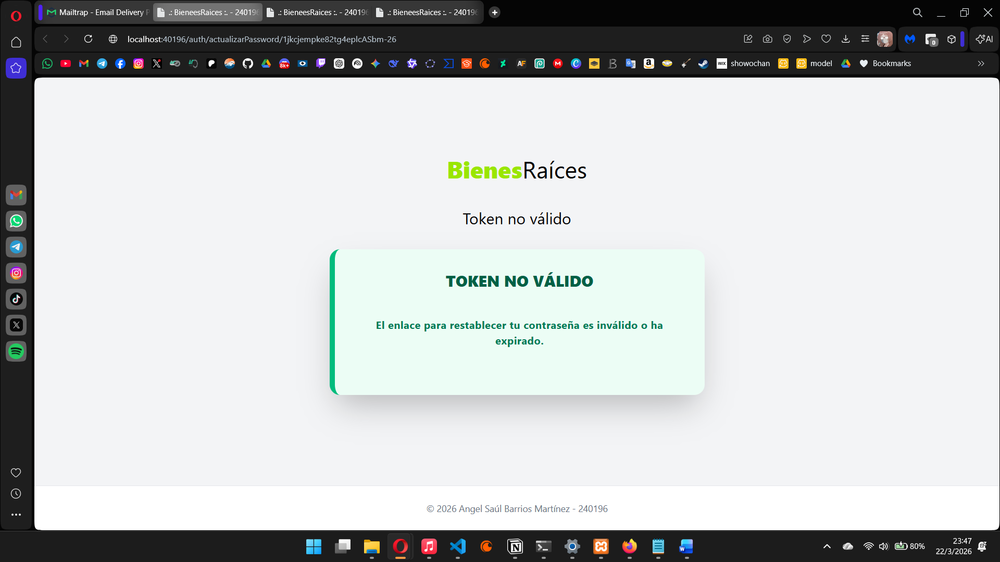

---

### **Test 9: Logeo Exitoso y Dashboard**
* **Objetivo:** Validar el acceso correcto a las áreas protegidas (Middleware de autenticación).
* **Descripción:** El usuario inicia sesión con credenciales válidas y es redirigido correctamente a la vista de "Mis Propiedades".
* **Evidencias:** 
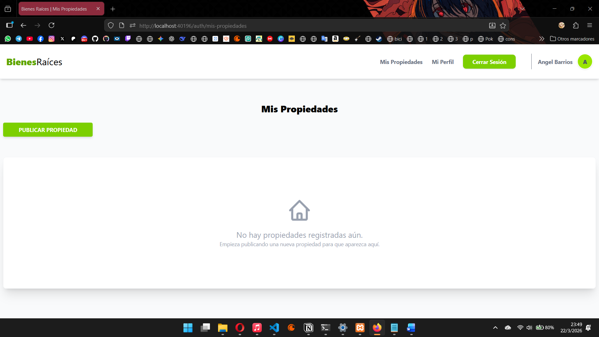

---

### **Test 10: Bloqueo de Cuenta por Exceso de Intentos**
* **Objetivo:** Evaluar la medida de seguridad contra ataques de fuerza bruta.
* **Descripción:** Tras 5 intentos fallidos consecutivos, la cuenta se bloquea, se notifica al usuario y se envía un correo de desbloqueo seguro.
* **Evidencias:** 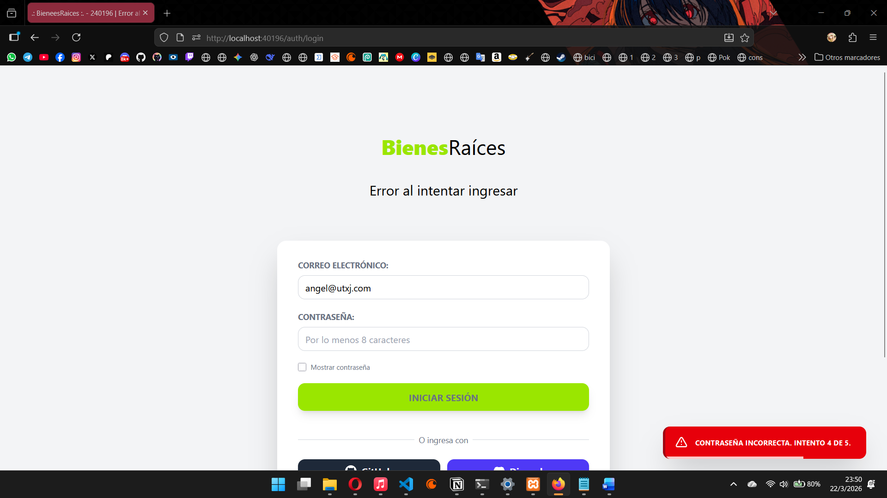
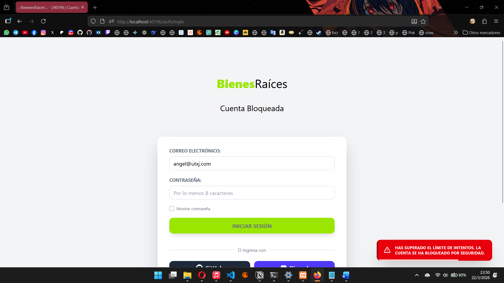
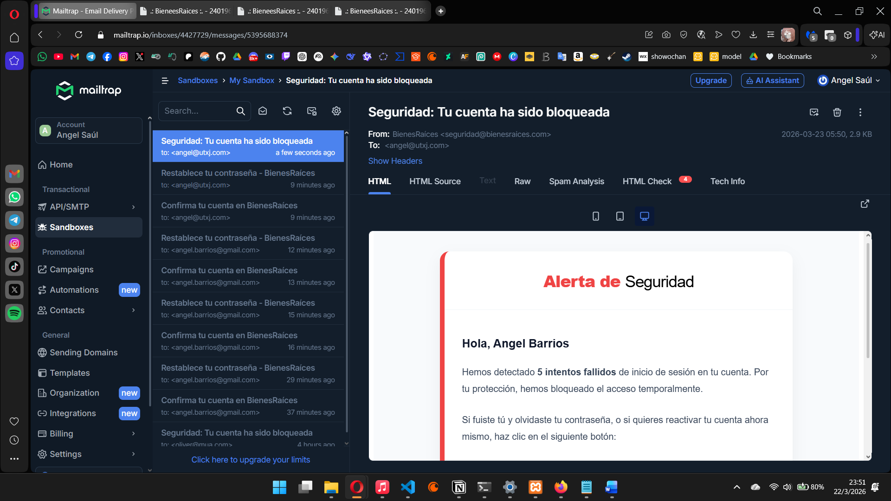
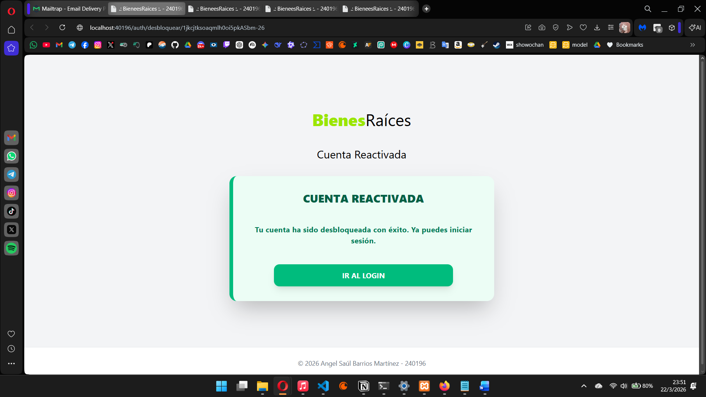

